<p align="center">
  
</p>

<p align="center">
  <strong>昨晚到底睡得怎么样，SleepClaw 帮你说明白。</strong>
</p>

<p align="center">
  把 Apple Watch、脑电数据和你的真实感受放在一起，边问边分析，<br>
  最后给你一份看得懂、做得到的睡眠报告。
</p>

<p align="center">
  🧠 EEG&nbsp;&nbsp; · &nbsp;&nbsp;⌚ Apple Watch&nbsp;&nbsp; · &nbsp;&nbsp;💬 逐题追问&nbsp;&nbsp; · &nbsp;&nbsp;📈 长期变化
</p>

<p align="center">
  
  
  
</p>

<p align="center">
  <a href="#problem">🛏️ 它能做什么</a>
  ·
  <a href="#workflow">🔍 怎么工作</a>
  ·
  <a href="#report">📋 报告长什么样</a>
  ·
  <a href="#progress">🛠️ 开发进度</a>
  ·
  <a href="#join">👋 参与讨论</a>
</p>

<p align="center">
  <sub>抢先预告 · 正在开发</sub>
</p>

---

<a id="problem"></a>
## 🛏️ 它想解决什么问题

手表告诉你睡了 7 小时 24 分钟、深睡 42 分钟、夜里醒了 3 次。可你早上起来还是很累。

接下来的问题才真正重要：

- 我昨晚到底睡得好不好？
- 是睡得太短，还是中间醒得太碎？
- 为什么手表说「睡得不错」，我自己却没精神？
- 咖啡、压力、运动或作息，哪个更可能影响了这一晚？
- 今晚先改什么，最省事也最值得？

SleepClaw 想把这些问题讲明白。你把手头的数据交给它，它会先看数据，再根据这一晚的情况一题一题地追问，带着你的回答重新分析，最后整理成一份能直接看懂的报告。

没有设备也能用；有 Apple Watch，能多一份客观记录；有 EEG，可以继续看更细的睡眠结构。SleepClaw 会在对话里自动判断该怎么分析，你不用提前研究该选哪个模式。

> [!NOTE]
> SleepClaw 用来帮助你了解日常睡眠、调整生活习惯，不提供疾病诊断。如果你长期严重失眠、白天嗜睡明显，或出现其他让你担心的症状，请及时咨询医生。

<a id="workflow"></a>
## 🔍 它怎么分析一晚睡眠


### 📱 你有什么数据，它就从哪里开始

| 你现在有的数据 | SleepClaw 会怎么分析 |
| --- | --- |
| 🗣️ 什么设备都没有 | 通过详细问答、个人睡眠档案和过去的记录，先做一份基础分析。 |
| ⌚ Apple Watch／Apple Health 导出 | 读取睡眠时长、夜醒、睡眠阶段、心率、呼吸率等可用数据，再用大白话解释。 |
| 🧠 EEG | 分析脑电信号质量和睡眠阶段等信息，帮助你更细地了解这段睡眠。 |
| 🔗 EEG＋可穿戴设备 | 把不同设备的数据放到同一条时间线上，看它们能不能互相印证。 |

### 💬 它会追问，但不会像填长表格

第一次使用时，SleepClaw 会一题一题地了解你的基本情况，包括平时作息、长期睡眠困扰、常用药物和白天精神状态。这些信息会保存在本地个人档案里，以后不用每次重问。

分析某一晚时，它会根据数据继续问当晚发生了什么，例如：

- 下午或晚上喝了多少咖啡、茶或能量饮料？
- 有没有饮酒、晚吃、加班或睡前刷手机？
- 当天压力、运动量和情绪怎么样？
- 你记得自己什么时候睡着、夜里醒过几次吗？
- 早上醒来是清醒、有点累，还是特别疲惫？

每轮只问 1～3 个真正有用的问题。你可以跳过某一题，也可以随时让它停止追问、直接生成当前报告。

你的回答会影响下一轮分析重点。比如手表显示睡眠时长够了，但你醒来仍然很累，SleepClaw 就会继续看夜醒、心率变化、作息偏移和主观压力，而不会只重复告诉你「睡了多久」。

---

<a id="report"></a>
## 📋 报告会告诉你什么

报告开头先把结论说清楚，然后再解释「哪里做得好、哪里拖了后腿、可能受什么影响、今晚先做什么」。

```text
SleepClaw · 昨晚睡眠报告

76 / 100   比你最近两周的平均情况稍好

一句话总结
昨晚睡得不算少，主要问题是中间醒得有点碎。
虽然深睡时间看起来正常，但你早上的疲惫感仍然偏高，
晚间压力和偏晚入睡可能更值得关注。

今晚先做这一件事
把最后一杯含咖啡因饮料提前到下午 2 点前，连续试 3 晚，
看看入睡时间和早上精神有没有变化。
```

### 📊 五个维度，回答五个实际问题

| 维度 | 说人话就是 |
| --- | --- |
| ⏱️ 睡眠时长 | 昨晚到底睡够没有？ |
| 🌙 睡眠连续性 | 中间醒得多不多，睡得稳不稳？ |
| 🧠 睡眠结构 | 浅睡、深睡、REM 大致怎么分布？ |
| 🗓️ 作息规律 | 入睡和起床时间有没有偏离你平时的节奏？ |
| 🙂 主观恢复 | 这些数据和你醒来的真实感觉对得上吗？ |

### 📈 数据越多，分析会越来越懂你

| 已有记录 | 能做到的分析 |
| --- | --- |
| 🌙 1 晚 | 复盘这一晚怎么睡的、分数为什么高或低、设备记录和本人感受是否一致。 |
| 📅 7～14 晚 | 建立你的初步基线，判断最近是偶尔没睡好，还是连续出现同一种问题。 |
| 📈 28 晚以上 | 对比相似夜晚，看看咖啡、压力、运动、饮酒和作息变化可能带来什么影响。 |

SleepClaw 给出的建议会尽量具体。它会告诉你「今晚先做什么、为什么先做这个、试几晚、下一次看什么变化」，避免一次塞给你十几条很难坚持的通用建议。

报告会把设备估算、用户提供的信息和 AI 的分析分开说明。AI 生成的内容可能出错，重要判断请结合自己的实际感受和专业意见。

---

## 🧭 我们最在意的几件事

| 我们在意什么 | 实际会怎么做 |
| --- | --- |
| 🎯 先和你自己比 | 优先参考你的历史和习惯，少用一条固定标准评价所有人。 |
| 🗣️ 把话说明白 | 专业指标后面都会跟一句容易理解的解释。 |
| 🐾 少折腾用户 | 一次只问少量关键问题，建议也从最值得做的一件事开始。 |
| 🔎 知道哪里不确定 | 设备估算、用户回忆和 AI 推测会分开写清楚。 |
| 🔒 数据留在自己手里 | 原始睡眠记录优先在本地处理和保存。 |

---

<a id="progress"></a>
## 🛠️ 现在做到哪了

| 阶段 | 正在做的内容 | 状态 |
| --- | --- | --- |
| 🧩 Agent 基础 | 本地 CLI 对话、用户自己配置模型、恢复历史会话和 SleepClaw 品牌界面 | 开发中 |
| 🧾 首次使用 | 一题一题建立个人睡眠档案 | 接下来做 |
| ⌚ Apple Health | 读取 Apple Watch／Apple Health 导出并解释指标 | 接下来做 |
| 🧠 EEG 分析 | 导入 EEG、估计睡眠阶段并与其他信息一起分析 | 规划中 |
| 📋 个人报告 | 睡眠评分、五个维度、原因分析和个性化建议 | 规划中 |
| 📈 长期改善 | 个人基线、相似夜晚对比和小型睡眠实验 | 规划中 |

第一个版本先服务普通用户。EEG 查看与标注工具会单独开发；临床相关能力暂时不放进当前版本。

---

<a id="join"></a>
## 👋 一起聊聊

SleepClaw 还在开发。你可以先给仓库点个 Star 或 Watch，后面有内测和开发进展会在这里更新。

也欢迎告诉我们：

- ⌚ 你现在用什么记录睡眠？
- 📊 Apple Watch 里的哪个数字最让你看不懂？
- 💭 你最想让一份睡眠报告回答什么？
- 🌙 什么样的建议，才会让你第二天真的愿意试一下？

---

<p align="center">
  <strong>SleepClaw</strong><br>
  <sub>先把昨晚讲明白，再把下一晚睡好一点。</sub>
</p>
