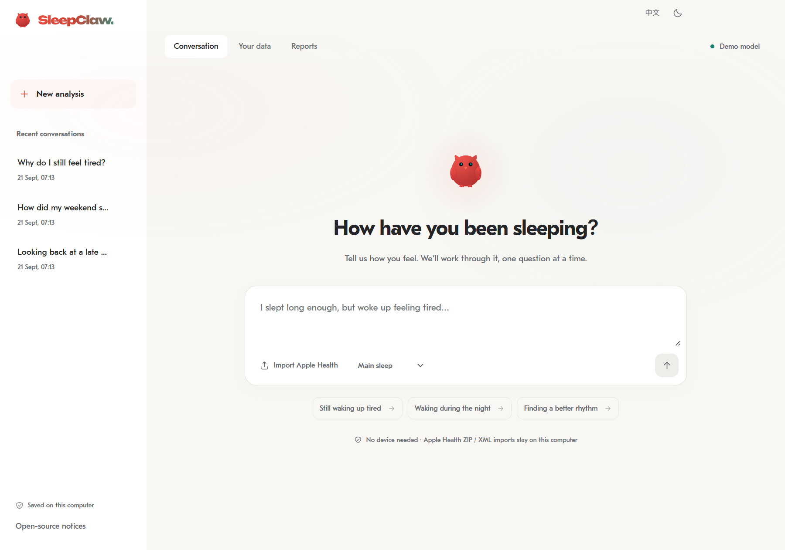
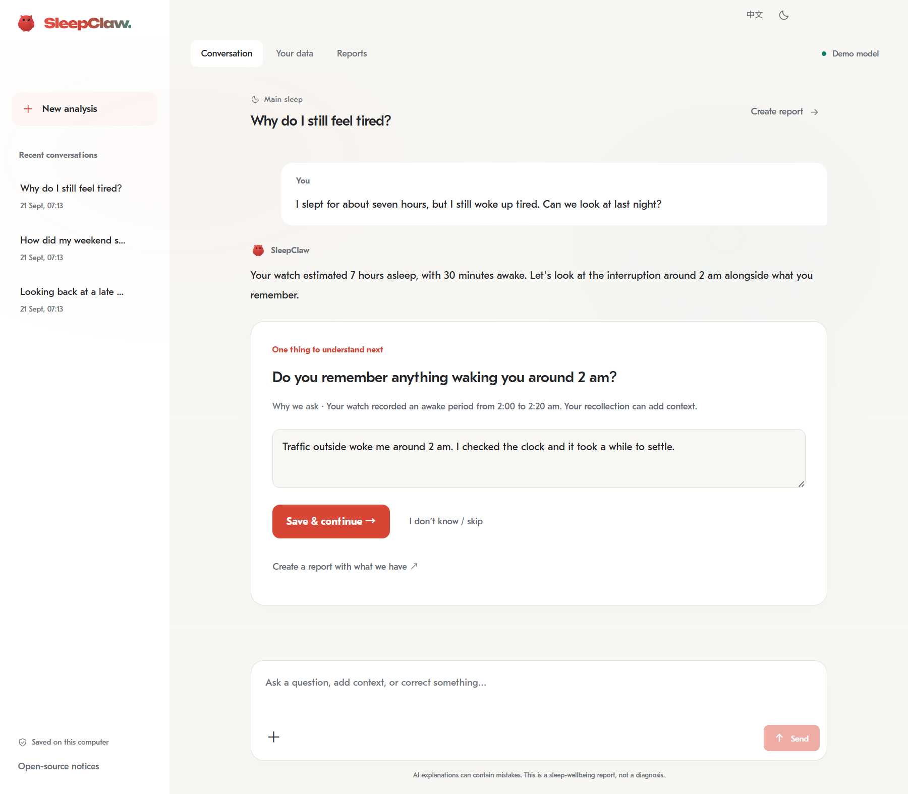
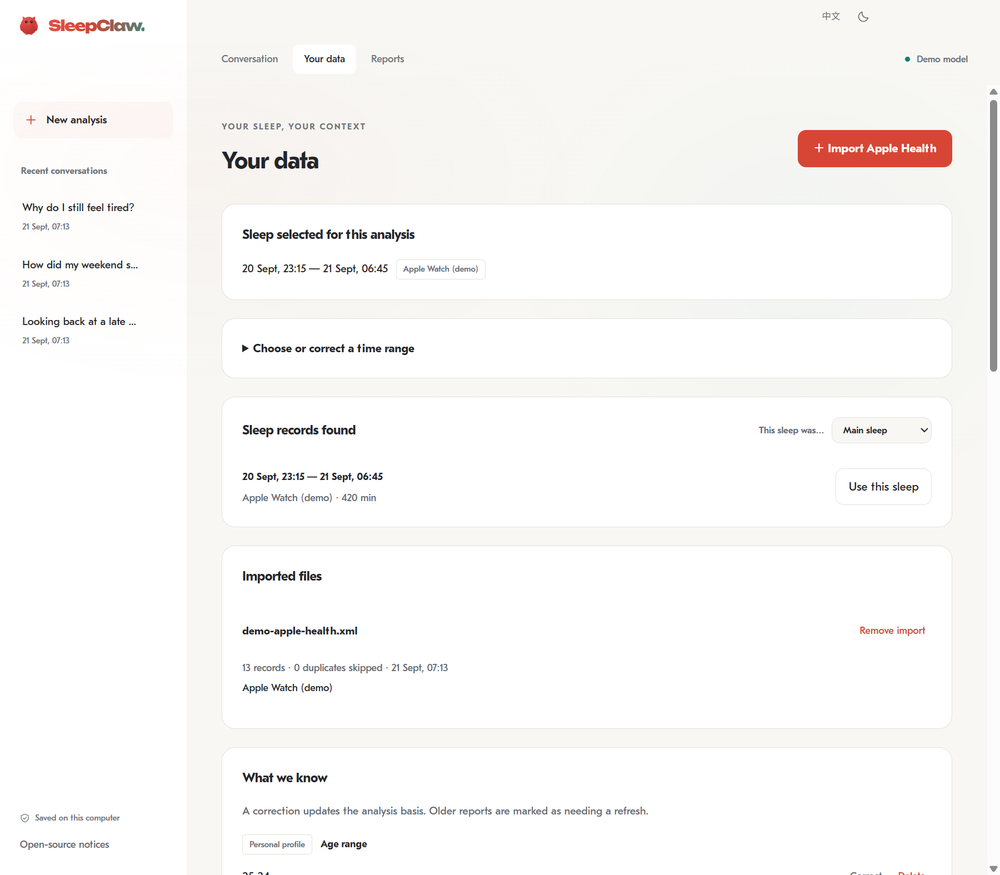
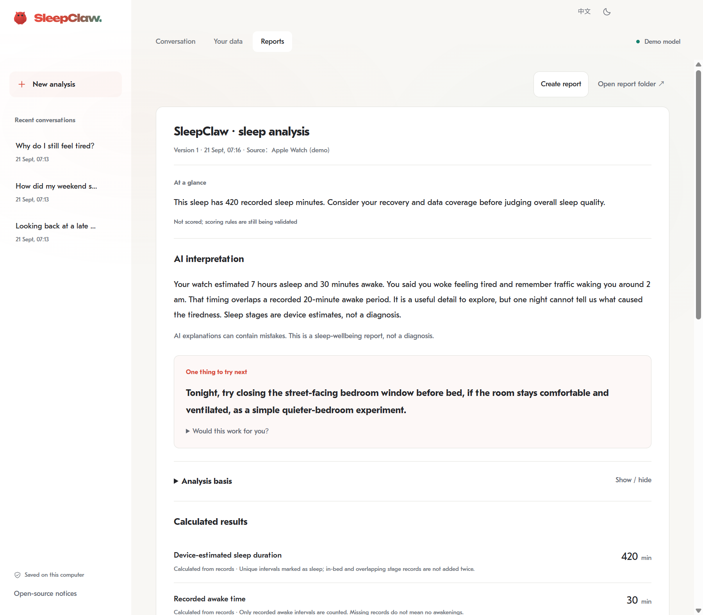
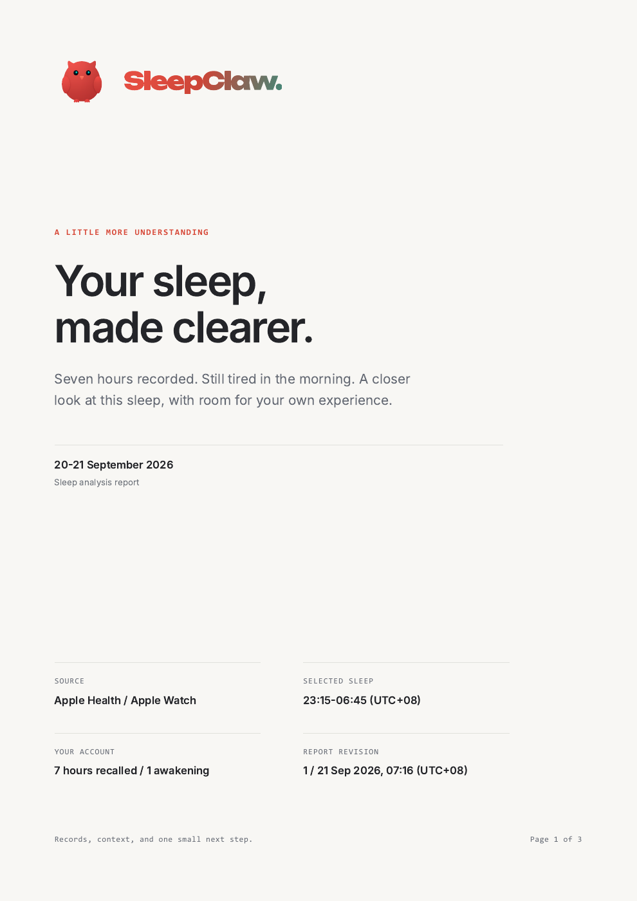
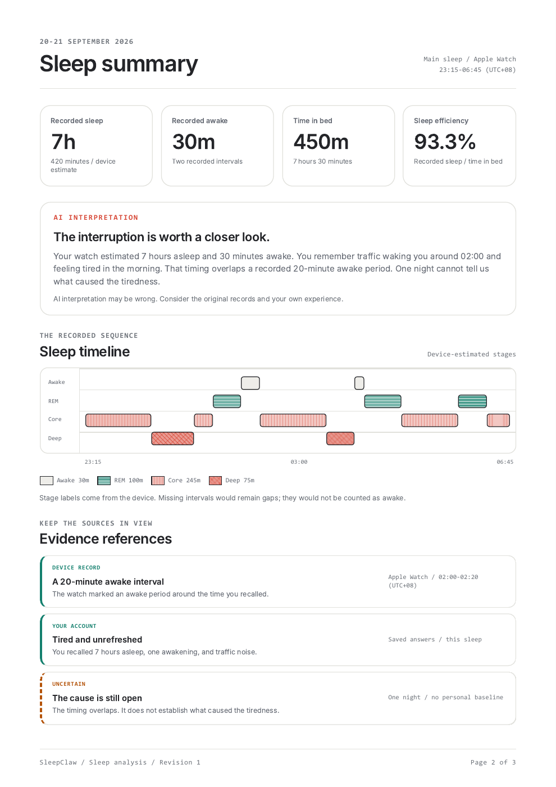
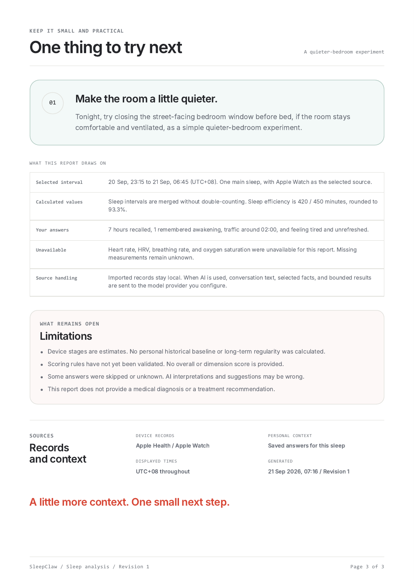

<p align="center">
  
</p>

<p align="center">
  <strong>昨晚到底睡得怎么样，SleepClaw 帮你说明白。</strong>
</p>

<p align="center">
  把你的睡眠感受与可用的 Apple Health 记录放在一起，逐题问清，<br>
  再整理成一份看得懂、方便回看的睡眠报告。
</p>

<p align="center">
  🖥️ 本地桌面&nbsp;&nbsp; · &nbsp;&nbsp;⌚ Apple Health&nbsp;&nbsp; · &nbsp;&nbsp;💬 一次一题&nbsp;&nbsp; · &nbsp;&nbsp;📋 睡眠报告
</p>

<p align="center">
  
  
  
  
</p>

<p align="center">
  <a href="#problem">🛏️ 它能做什么</a>
  ·
  <a href="#workflow">🔍 怎么工作</a>
  ·
  <a href="#report">📋 看看报告</a>
  ·
  <a href="#start">🚀 从源码运行</a>
  ·
  <a href="#progress">🛠️ 当前进度</a>
</p>

<p align="center">
  
</p>

<p align="center">
  <sub>界面预览</sub>
</p>

---

<a id="problem"></a>

## 🛏️ 先把这一晚问清楚

手表上的睡眠时长、阶段和夜醒记录，常常解释不了「为什么醒来还是累」。SleepClaw 把设备记录、你的回答与分析依据放在同一次调查里，帮助你回看这一晚，也留下一个可以尝试的小行动。

没有设备也能开始。你可以逐题回答、跳过不确定的问题，或随时生成当前信息下的本地简报。连接自己选择的模型服务后，再使用 AI 对话、动态追问和定向数据查询。

| 你想做什么 | 当前可以怎么做 |
| --- | --- |
| 🗣️ 先说说自己的睡眠 | 一次回答一题，分别保存个人档案与本次睡眠的信息。 |
| ⌚ 看看 Apple Health 记录 | 在本地导入原始 XML 或含 `export.xml` 的 ZIP，选择日期、来源与目标时段。 |
| 🔍 把不清楚的地方问明白 | 连接模型后，结合回答继续追问，并重新查询相关时间范围。 |
| 📋 整理成报告 | 分开展示工具计算的指标、自述信息、AI 解读、局限与一条行动。 |
| 🔁 回来接着聊 | 恢复调查和未答问题；修改答案后让旧报告标记失效，再生成新版本。 |
| 🗑️ 管理自己的记录 | 删除分析及其聊天、答案、报告和反馈；共享导入与个人档案另行管理。 |

> [!NOTE]
> SleepClaw 是开发中的日常睡眠理解工具，不提供诊断或治疗建议，也未经临床验证。设备估算、用户回忆和 AI 解读都可能存在误差。

<a id="workflow"></a>

## 🔍 一次调查怎么进行


### 💬 一次一题，随时停下来整理

基础问卷逐题保存进度，已知信息不用反复填写。你可以跳过、修改答案、提前生成简报，也可以关闭应用后回来继续。连接模型后，Agent 能根据已有信息提出新的问题，再带着回答查询相关数据；禁用全部 Skills 仍可使用核心流程。

<p align="center">
  
  <br>
  <sub>💬 调查示例</sub>
</p>

### ⌚ 原始 Apple Health 导出，留在本地处理

直接导入 Apple Health 原始 XML 或 ZIP，无需额外购买导出工具。导入后查看可用日期、设备来源与候选睡眠，再选择你真正想分析的那一段。主要睡眠、午睡与片段都可选，也支持手动设置时间范围；应用不会直接把最近记录当作你的目标。

导入支持流式处理、取消和去重。多个来源存在重叠时，需要明确分析来源；没有记录的指标保持未知。设备睡眠阶段只作为设备估算呈现。

<p align="center">
  
  <br>
  <sub>⌚ 导入记录</sub>
</p>

---

<a id="report"></a>

## 📋 报告先说清楚，再展开依据

报告优先展示摘要、可用的 AI 解读与一条行动，再提供指标、来源、数据局限和行动反馈。数字由确定性工具计算；模型不能用生成文字改写这些指标。没有连接模型时，也能根据已有回答与记录生成本地简报。

<p align="center">
  
  <br>
  <sub>📋 报告示例</sub>
</p>

| 报告里的内容 | 如何理解 |
| --- | --- |
| ⏱️ 计算指标 | 来自选定来源、时段与明确的计算规则；缺失值保持未知。 |
| 🗣️ 自述信息 | 保留你对入睡、夜醒和恢复感的回答，与设备记录分开。 |
| 🔎 AI 解读 | 连接模型后提供，可能出错；需要结合已列出的依据与局限阅读。 |
| 🐾 一条行动 | 可以记录接受、做不到、没帮助或稍后再看，反馈保存在对应调查中。 |
| 🔁 报告版本 | 修改事实会让旧报告失效；重新生成后保存新版本。 |

**当前不提供总分或维度分数。** 评分规则尚未完成验证，应用明确显示不可用，不用缺失信息拼出一个分数。个人长期基线、相似夜晚对比和行动效果分析也尚未实现。

### 📄 离开聊天窗口，也能好好看报告

独立报告采用三页 A4 排版：先交代这一晚的背景，再展开指标、时间线和依据，最后留下一条可以尝试的行动。

<p align="center">
  <a href="./assets/demo/sleepclaw-report.pdf"></a>
  <a href="./assets/demo/sleepclaw-report.pdf"></a>
  <a href="./assets/demo/sleepclaw-report.pdf"></a>
  <br>
  <sub>独立报告预览 · 封面 / 睡眠摘要 / 下一步行动</sub>
</p>

📖 [查看完整 PDF 报告](./assets/demo/sleepclaw-report.pdf)

HTML/PDF 报告模板已完成，应用内 PDF 导出待接入。现有的 **Markdown + JSON** 导出可在这里查看：[阅读 Markdown](./assets/demo/exported-report.md) · [查看 JSON](./assets/demo/exported-report.json)。

## 🔒 哪些留在本地，哪些会发送给模型

- 📂 原始 Apple Health 文件在本地解析，应用不把完整健康导出上传给模型。用户原文件保持不变。
- 🖥️ 调查、档案、报告和 Pi 会话保存在本机。健康记录当前未加密；桌面 API Key 由 Electron safeStorage 保护。
- ☁️ 启用模型分析后，相关事实、聊天内容和工具查询结果会发送给你配置的模型服务；请先确认该服务的数据政策。
- 🗑️ 删除只覆盖应用管理范围。它不会删除原始导出、外部备份或模型服务已收到的内容，也不等同于磁盘取证级擦除。
- 🚫 当前不启用遥测、自动健康数据同步或自动更新服务。请勿在公开 Issue 中上传健康导出、数据库、密钥或个人报告。

---

<a id="start"></a>

## 🚀 从源码运行

当前开发与打包目标为 **Windows x64**，需要 **PowerShell 7、Node.js 24.13 或更高版本，以及 npm**。在本仓库根目录执行：

```powershell
cd pi-app
npm ci
npm start
```

首次打开可以连接模型，也可以先在本地体验。桌面支持 OpenAI-compatible 与 Anthropic Messages；API Key 在应用配置界面输入。启用 AI 功能需要你自己的兼容模型服务。

同一目录下也可以使用 CLI、检查类型与运行测试：

```powershell
npm run cli -- --help
npm run typecheck
npm test
```

桌面与 CLI 共用领域数据和 Pi 会话核心，请勿让两者同时写入同一个数据目录。存储位置、独立实例、模型配置与打包方法见 [开发说明](./pi-app/README.md)。

> [!IMPORTANT]
> 本仓库当前提供源码与演示，未在这里提供已验证的公开安装包下载。Windows 开发构建尚未签名，干净系统安装、真实模型服务兼容性、实际用户任务完成度与临床有效性均未完成验证。

<a id="progress"></a>

## 🛠️ 当前进度与边界

| 范围 | 当前状态 |
| --- | --- |
| 🖥️ Electron 桌面、Pi Agent 与共享 CLI | 已实现开发版；中文／英文、浅色／深色界面。 |
| 🧾 无设备问卷与本地简报 | 已实现；一次一题，可跳过、修改、恢复。 |
| ⌚ Apple Health 原始导入与指标计算 | 已实现；支持导入、去重、来源选择与缺失处理。 |
| 💬 AI 追问、重新查询与报告解读 | 已接入 Pi；模型与工具调用流程已通过本机测试，真实服务仍待验证。 |
| 📋 报告、行动反馈与删除 | 已实现；保留版本与失效状态，按关联范围清理。 |
| 📈 长期基线、相似睡眠对比、个人实验 | 后续规划，当前未实现。 |
| 🔄 自动同步、提醒与自动更新 | 当前未实现。 |
| 🧠 EEG／SleepGPT、临床／研究工作流 | 暂缓，当前版本不包含。 |
| 💯 睡眠总分与维度分 | 暂不计算，评分规则待验证。 |

技术上，Electron 管理窗口与本机能力，React／assistant-ui 展示交互，Pi 管理模型、工具与会话，SQLite 保存领域数据。指标计算与数据更正、失效、删除逻辑由应用代码负责。

### 📚 产品与开发文档

- 🧭 [产品路线](./docs/product/roadmap.md)：当前范围与后续阶段。
- 🧾 [第一阶段产品约定](./docs/product/phase-1.md)：调查流程、数据规则与验收要求。
- 🧪 [实施与验证记录](./docs/product/phase-1-validation.md)：实际测试证据及未完成的发布验证。
- 🖼️ [界面演示说明](./docs/product/demo.md)：截图范围与复现步骤。
- 🧩 [桌面架构](./docs/architecture/pi-desktop.md)：模块、存储与 Pi 集成边界。
- 🛠️ [开发说明](./pi-app/README.md)：运行、CLI、模型配置、存储与打包。
- 📜 [第三方声明](./pi-app/NOTICE.md)：依赖与设计资产许可；新应用代码采用 [MIT License](./pi-app/LICENSE)。

---

<a id="join"></a>

## 👋 一起聊聊

SleepClaw 还在开发。欢迎通过 Issue 反馈可复现的问题、难理解的交互或希望报告回答的问题，也可以 Star／Watch 关注进展。

- ⌚ 哪些睡眠数字让你难以理解？
- 💬 哪些问题你愿意回答，哪些问题让你觉得重复？
- 📋 什么信息能让你更清楚地理解一晚睡眠？
- 🐾 什么样的小行动值得你试一次？

提交问题时请使用不含个人信息的最小示例，并遮盖 API Key。

---

<p align="center">
  <strong>SleepClaw</strong><br>
  <sub>先把昨晚讲明白，再把下一晚睡好一点。</sub>
</p>
