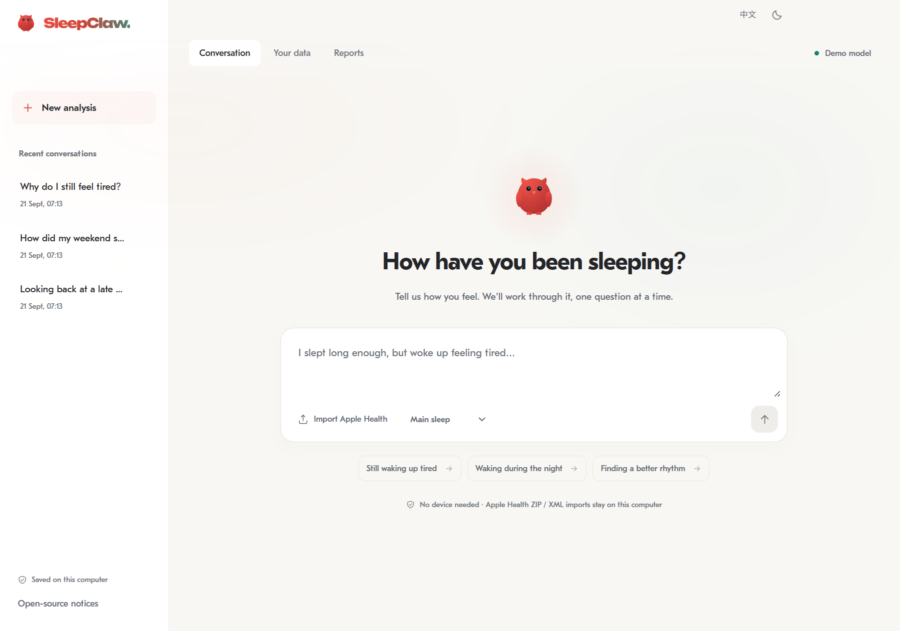
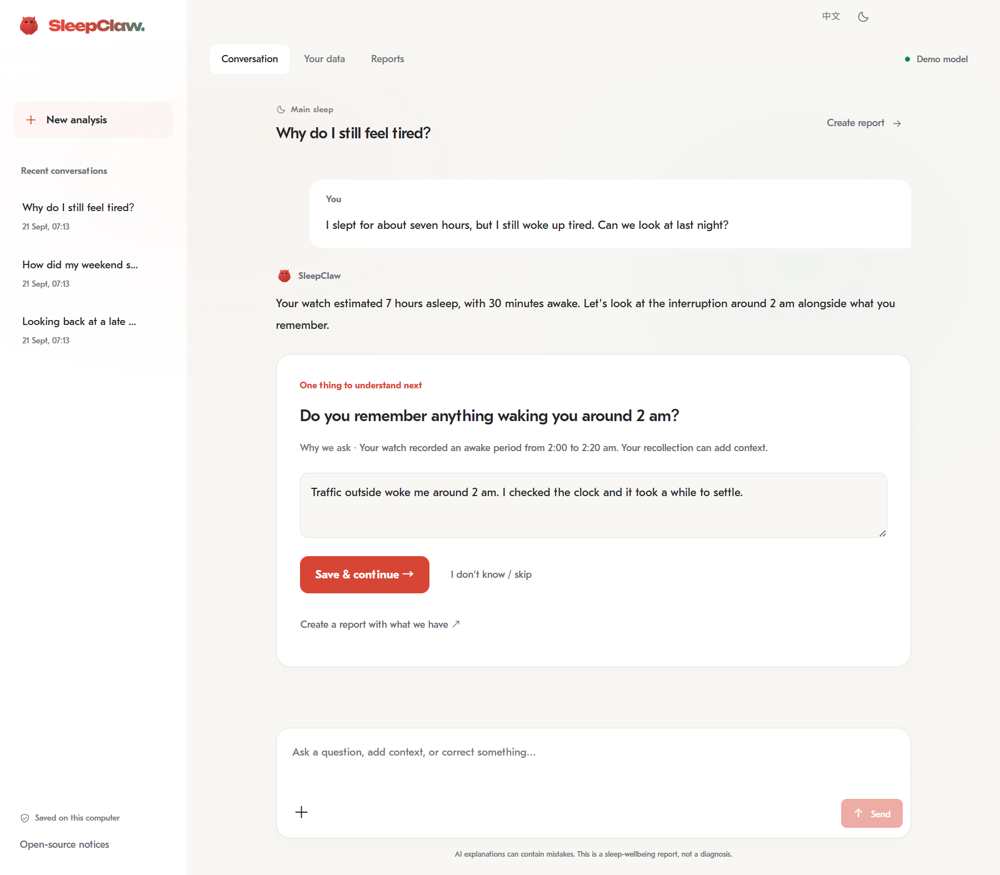
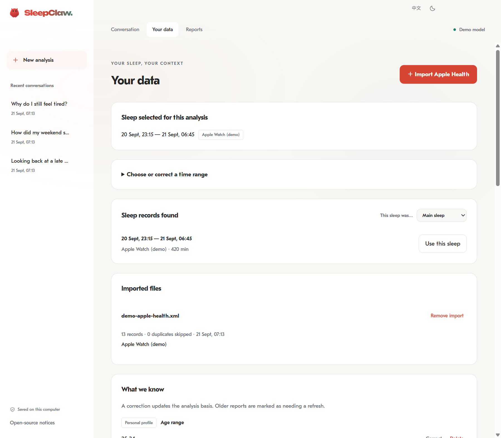
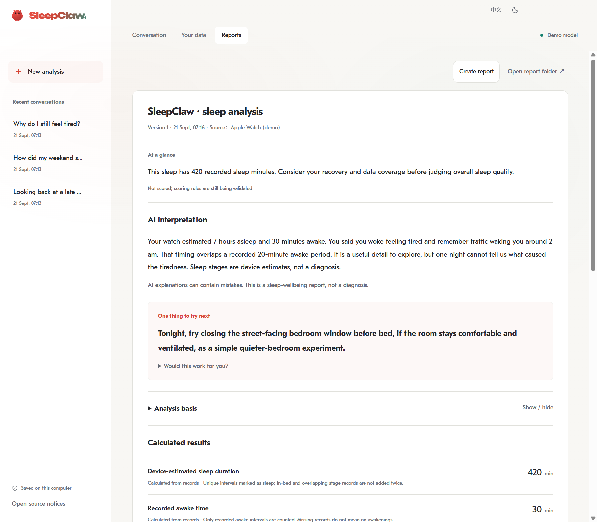
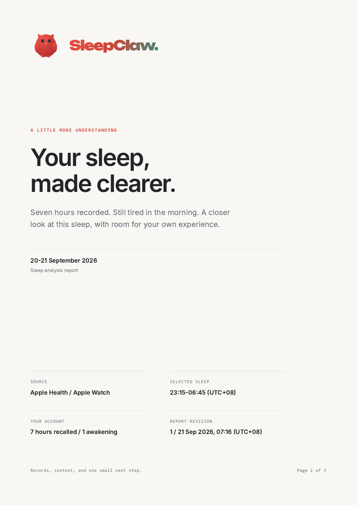
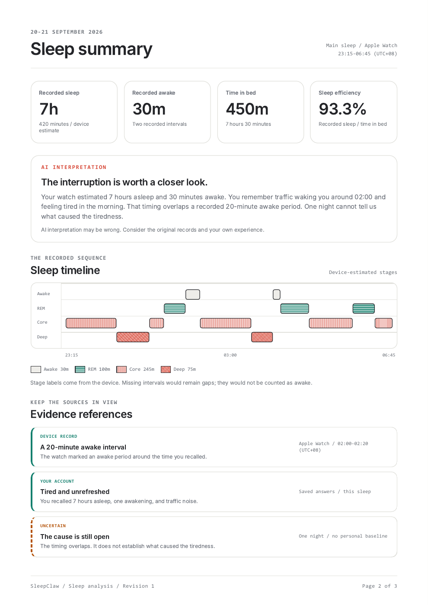
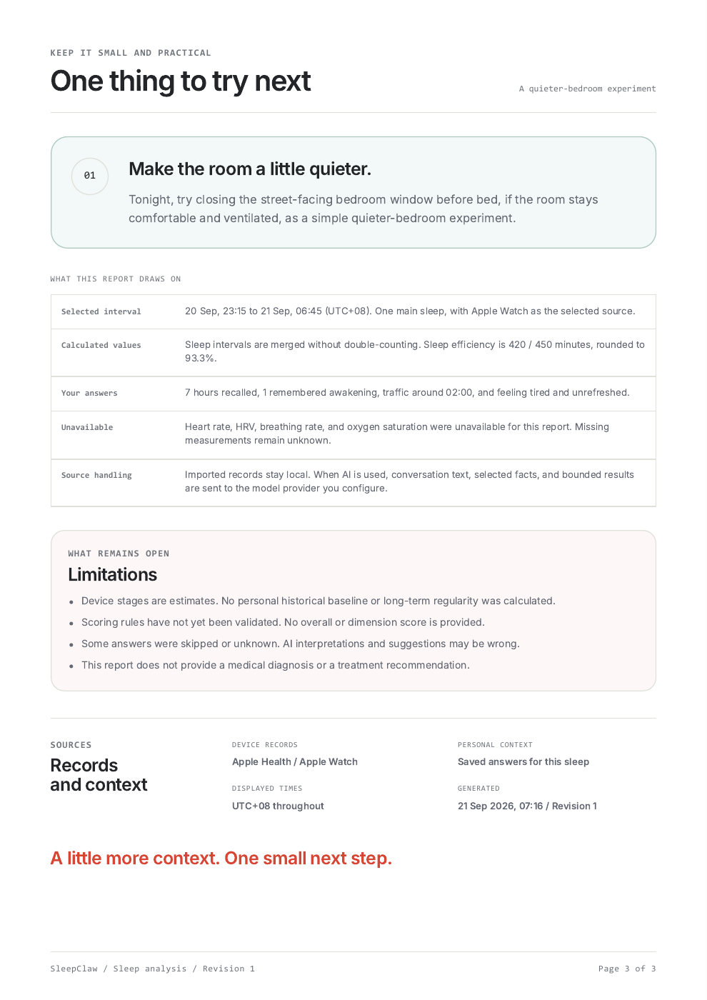

<div align="center">
  
  <p><b>Make sense of last night's sleep.</b></p>
  <a href="#status"></a>
  <a href="#run-from-source"></a>
  <a href="./pi-app/LICENSE"></a>
</div>

## Why

Seven hours on your watch can still leave you tired in the morning. SleepClaw brings your Apple Health records and your own account of a night into one conversation. Answer one question at a time, review the available evidence, and leave with a readable report and one practical next step.

You can start without a wearable or a model connection. The local questionnaire saves your answers and produces a brief from what you know. Connect your own model service for AI conversation, follow-up questions, and focused queries into your records.

SleepClaw is an early desktop app for everyday sleep understanding. It has no clinical validation and provides no diagnosis or treatment advice.

## Showcase

The desktop app supports English and Chinese, with light and dark themes. These previews use synthetic data and a local demo model. Click an image to view it at full size.

<table>
<tr>
  <td align="center" width="50%" valign="top">
    <a href="./assets/demo/home-light-en.png"></a>
    <br><b>Start</b>
    <br><sub>Describe your sleep or bring in your records.</sub>
  </td>
  <td align="center" width="50%" valign="top">
    <a href="./assets/demo/investigation-light-en.png"></a>
    <br><b>Talk</b>
    <br><sub>Work through one question at a time.</sub>
  </td>
</tr>
<tr>
  <td align="center" width="50%" valign="top">
    <a href="./assets/demo/data-light-en.png"></a>
    <br><b>Review</b>
    <br><sub>Choose the source and sleep period to explore.</sub>
  </td>
  <td align="center" width="50%" valign="top">
    <a href="./assets/demo/report-light-en.png"></a>
    <br><b>Reflect</b>
    <br><sub>Read the report and record feedback on the action.</sub>
  </td>
</tr>
</table>

## Run from Source

The current development and packaging target is **Windows x64**. Use **PowerShell 7**, **Node.js 24.13 or newer**, and **npm**.

```powershell
git clone https://github.com/okht/sleepclaw.git
cd sleepclaw/pi-app
npm ci
npm start
```

On first launch, choose local use or connect a model in the app's settings. Sign in with your ChatGPT subscription through Pi's native OAuth, or use an API key for OpenAI-compatible and Anthropic Messages services. Subscription models and limits depend on your account. Complete authorization in your browser; the connection panel also accepts the full callback URL if automatic return fails.

This repository provides source and demos. A verified public installer is not available here; development builds are unsigned.

**Codex and Claude Code**

The [SleepClaw plugin](./plugins/sleepclaw/README.md) provides MCP tools and a sleep investigation skill using the same calculations as the desktop app. It uses the host assistant's model, with a separate local data store by default.

From `pi-app/`, build it with:

```powershell
npm run plugin:build
```

Follow the [host setup instructions](./plugins/sleepclaw/README.md) to load the built plugin. It is currently distributed from source and has no plugin-store listing.

## Use

1. **Start an analysis.** Describe what you want to understand, or begin with the local questionnaire.
2. **Add records if you have them.** Import an Apple Health XML file or a ZIP containing one `export.xml`. Choose the source and target period: a full night, a nap, or a shorter interval.
3. **Answer at your own pace.** Skip a question, correct an answer, or return later. With a model connected, the agent can ask follow-up questions and query the relevant time range again.
4. **Generate a report.** Request one whenever you are ready. It includes the available metrics, your account, any AI interpretation, known limits, and one suggested action.
5. **Come back to it.** Record whether the action was useful. Correcting facts marks earlier reports as out of date; generating again saves a new version.

Example requests with a model connected:

- `I slept for about seven hours but still woke up tired. Help me look at last night.`
- `I remember waking around 2 am. What do my records show between 2 and 2:30?`
- `I'm not sure when I fell asleep. Keep that uncertain and make a report with what we have.`

## Reports

Reports keep calculated metrics, self-reported information, and AI interpretation separate. Start with the summary and one action, then read the sources and limits behind them.

The app exports **Markdown and JSON**. See the [sample Markdown report](./assets/demo/exported-report.md) and its [structured JSON](./assets/demo/exported-report.json).

A separate three-page A4 report template is also available. Click a preview to open the PDF.

<table>
<tr>
  <td align="center" width="33%" valign="top">
    <a href="./assets/demo/sleepclaw-report.pdf"></a>
    <br><b>Context</b>
  </td>
  <td align="center" width="33%" valign="top">
    <a href="./assets/demo/sleepclaw-report.pdf"></a>
    <br><b>Evidence</b>
  </td>
  <td align="center" width="33%" valign="top">
    <a href="./assets/demo/sleepclaw-report.pdf"></a>
    <br><b>Next step</b>
  </td>
</tr>
</table>

The HTML/PDF template is a design preview. In-app PDF export is still pending.

## How It Works

- **One question at a time.** Long-term profile information and facts about a particular sleep are stored separately. Saved progress lets you resume an unanswered question.
- **Your choice of records.** You choose the source and time range. Imports support streaming, cancellation, and deduplication. Overlapping sources require a selection.
- **Reproducible numbers.** Application code calculates sleep coverage, gaps, conflicts, and sample statistics for heart rate, HRV, respiration, and oxygen saturation. The model's text cannot overwrite these metrics.
- **Visible uncertainty.** Missing data stays unknown. Recalled ranges stay ranges. Device sleep stages are presented as device estimates, and AI interpretations can be wrong.
- **Revision history.** Corrections invalidate affected reports. New reports keep their own versions, with action feedback attached to the corresponding analysis.

Electron handles the desktop, React and assistant-ui render the interface, Pi manages model execution and sessions, and SQLite stores domain data. The CLI and host plugin share the domain calculations. See the [desktop architecture](./docs/architecture/pi-desktop.md) and [shared tools design](./docs/architecture/sleep-tools-plugin.md).

## Privacy

Apple Health archives are parsed locally. SleepClaw leaves your original files unchanged and does not upload the full health export to a model.

- **On your computer:** profiles, imported records, investigations, reports, and desktop Pi sessions. Health data is currently unencrypted; desktop API keys and ChatGPT OAuth credentials are protected by Electron safeStorage. Subscription sign-out removes this app's credentials while retaining sleep data.
- **With a model connected:** relevant facts, chat content, and tool results are sent to the service you configure. Plugin tool results enter the host conversation and may be sent to its model provider.
- **When deleting a desktop analysis:** its answers, reports, feedback, and session are removed. Shared imports and your profile are managed separately. The plugin currently has no delete tool.
- **Background services:** no telemetry, automatic health sync, or automatic updates are enabled.

Deletion leaves original files, external backups, provider-held data, and host chat history untouched. It does not guarantee forensic erasure.

Desktop data defaults to `%USERPROFILE%\.sleepclaw-pi`; plugin data defaults to `~/.sleepclaw-tools`. See the [storage and configuration guide](./pi-app/README.md) for custom locations. Keep health exports, databases, personal reports, and credentials out of public issues.

## Development

From `pi-app/`:

```powershell
npm run cli -- --help
npm run typecheck
npm test
```

The desktop and CLI share domain data and the Pi session core. Use separate data directories if running them concurrently. The core investigation flow works with all skills disabled. Build, packaging, model configuration, and storage details are in the [development guide](./pi-app/README.md).

- [Product roadmap](./docs/product/roadmap.md)
- [Phase 1 product contract](./docs/product/phase-1.md)
- [Implementation and validation record](./docs/product/phase-1-validation.md)
- [Demo setup and screenshot scope](./docs/product/demo.md)

Some detailed product and development documents are currently in Chinese.

## Status

Automated tests and local protocol fixtures cover the implemented workflows. Compatibility with real model services, installation on a clean Windows machine, and task completion by real users still need validation.

Sleep scores remain unavailable while scoring rules await validation. Personal baselines, similar-night comparisons, action-effect analysis, automatic sync, reminders, and automatic updates are planned work. EEG, SleepGPT, and clinical or research workflows are outside the current version.

## Contributing

Issues and pull requests are welcome. Useful feedback includes a question that felt repetitive, a report that was hard to understand, or a reproducible failure. Use synthetic examples and remove personal data and API keys.

## License

The [desktop application](./pi-app/LICENSE) and [host plugin](./plugins/sleepclaw/LICENSE) are licensed under MIT. See [third-party notices](./pi-app/NOTICE.md) for dependency and design-asset terms.
